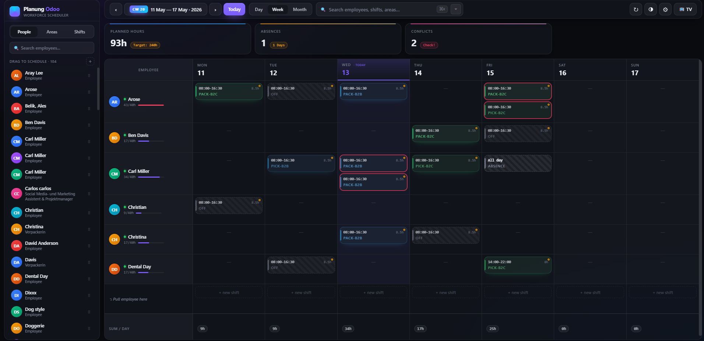
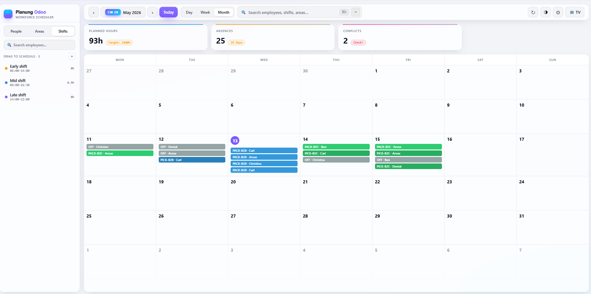
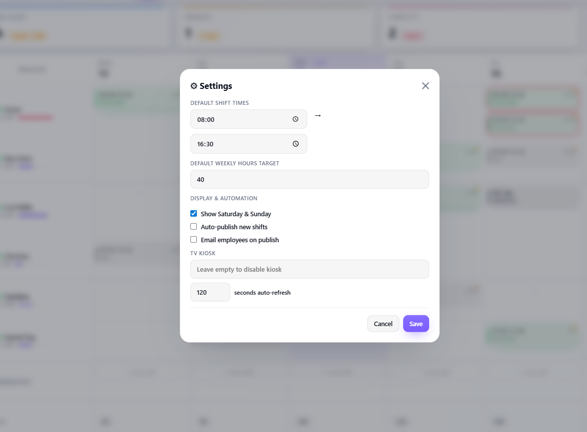

# Shift Planning Turbo

A modern weekly shift planner for Odoo Community 19, designed for warehouses,
production lines, retail, and hospitality teams that need an at-a-glance overview
of who works where, when — without the overhead of a full WFM suite.



## Features

- **Drag & drop weekly grid** — drag employees, area chips, or shift templates
  onto cells. Reschedule by dropping a shift on a new cell.
- **Four view modes** — Day, Week, Month, Year — switchable with a single click.
- **Reusable shift templates** — predefined shifts like *Early 06:00–14:00* you
  can drag onto the grid; comes seeded with Early / Mid / Late.
- **Live KPIs** — planned hours vs. target, occupancy rate, absences, conflict
  count. Click a card to drill into a breakdown.
- **Conflict detection** — overlapping shifts for the same employee on the same
  day are flagged automatically, with a side-by-side Resolve dialog.
- **Draft & Published workflow** — plan in draft, publish when ready. Only
  published shifts reach the TV kiosk.
- **HR Holidays integration** — approved leaves from `hr.leave` appear
  automatically in the planner and on the kiosk.
- **Copy Previous Week wizard** — clone a whole week, with optional
  *only published* filter and *delete target week first* option.
- **TV / shop-floor kiosk page** — auto-refreshing, token-protected public
  display of the published roster.
- **My Schedule** — read-only personal schedule page for every internal user.
- **Print-friendly view** — A4 landscape, repeating headers across pages.
- **Per-employee weekly hours target** — full-time 40h, part-time 20h, mini-job
  10h, etc. — drives the workload bar correctly for everyone.
- **Email notifications on publish** (configurable).
- **Color-coded areas / roles** with hex-validated colors and a kanban color
  index, plus the *Is Absence* flag for vacation / sick / off-duty areas.
- **Live search** across employees, shifts, areas, and notes.
- **Multi-company** — proper record rules ship out of the box.
- **Access control** — `Shift Planner` (full access) vs `Shift Viewer`
  (My Schedule only). HR Managers automatically get Planner rights.
- **GDPR-aware** — no external CDN, no analytics, no third-party fonts.
  The kiosk only ever shows a generic *Absent* label — the leave type
  (sick, vacation, etc.) is never exposed.
- **21 languages** — English (source), German, Spanish, French, Italian,
  Portuguese, Brazilian Portuguese, Dutch, Polish, Czech, Slovak, Romanian,
  Hungarian, Finnish, Swedish, Danish, Turkish, Russian, Ukrainian, Arabic,
  Japanese, Chinese (Simplified).

## Screenshots

**Month view** — switch between Day / Week / Month / Year:



**My Schedule** — read-only employee self-service:


**Settings** — defaults, kiosk token, notifications:



## Installation

1. Copy the `dienstplan_lager` folder into your Odoo addons path.
2. Update the apps list (`Apps → Update Apps List`).
3. Install **Shift Planning Turbo** from the Apps screen.
4. Open the new top-level menu **Shift Planning**.

## Configuration

### Areas

**Shift Planning → Configuration → Areas** to define your work zones / roles.
Each area has:

- a name (translatable)
- a short code shown on the kiosk and grid (e.g. `PICK-B2C`)
- a kanban color index and an HTML hex color (validated — `#abc` or `#aabbcc`)
- an *Is Absence* flag (for off-duty / leave area types)
- an optional company (leave empty for global / shared across companies)

The module ships with five seeded areas — Picking B2C, Packing B2C, Picking B2B,
Packing B2B, Special Assembly — plus one *Off* absence area.

### Shift Templates

**Shift Planning → Configuration → Shift Templates** to define reusable shifts
(e.g. *Early 06:00–14:00*) you can drag straight onto a grid cell. Times are
validated (hour 0–23, minutes 0/15/30/45).

### Employee defaults

On the employee form (HR app) there is a new **Shift Planning** tab where you
can set:

- *Default Shift Area* — pre-filled when a new shift is created for this employee
- *Allowed Areas* — restrict scheduling to specific areas
- *Weekly hours target* — drives the workload bar (40 / 20 / 10 / …)

### System settings

**Settings → General Settings → Shift Planning**, or click the gear icon in
the planner UI (Shift Planner group only). All settings are stored as
`ir.config_parameter` entries:

| Setting                              | Default | Parameter key |
|--------------------------------------|---------|---------------|
| Default shift start hour             | 8       | `dienstplan_lager.default_start_hour` |
| Default shift start minute           | 0       | `dienstplan_lager.default_start_minute` |
| Default shift end hour               | 16      | `dienstplan_lager.default_end_hour` |
| Default shift end minute             | 30      | `dienstplan_lager.default_end_minute` |
| Default weekly hours target          | 40.0    | `dienstplan_lager.default_weekly_hours` |
| Show Saturday & Sunday columns       | True    | `dienstplan_lager.show_weekends` |
| Auto-publish new shifts              | False   | `dienstplan_lager.auto_publish` |
| Email employees when shifts are published | False | `dienstplan_lager.notify_on_publish` |
| TV Kiosk access token                | *empty* | `dienstplan_lager.kiosk_token` |
| Kiosk auto-refresh (seconds)         | 120     | `dienstplan_lager.kiosk_refresh` |

### TV kiosk — security

The kiosk URL `/dienstplan/kiosk` is **disabled by default** and shows an
information page until an administrator sets a token. This is intentional:
the kiosk runs without login so it can be shown on a passive screen, and we
do not want employee names exposed on the public internet without protection.

To enable it:

1. Generate a strong random token:

   ```bash
   python3 -c "import secrets; print(secrets.token_urlsafe(32))"
   ```

2. **Settings → Technical → Parameters → System Parameters** — set:

   - Key: `dienstplan_lager.kiosk_token`
   - Value: *the random token from step 1*

3. Open the kiosk on the TV / browser:

   ```
   https://your-odoo-host/dienstplan/kiosk?token=YOUR_TOKEN
   ```

The kiosk only displays:

- employee name
- area code and time for *published* shifts
- a generic *Absent* placeholder for approved leaves (the holiday type is
  **never** exposed on the kiosk)

Token comparison uses `hmac.compare_digest` to defeat timing attacks.

## Privacy / GDPR notes

- No external CDN. No Google Fonts. No analytics. No third-party requests of
  any kind from the planner or kiosk pages.
- The kiosk hides the leave type / reason. Employees are listed by full name,
  which is unavoidable for a roster display — restrict the kiosk URL to your
  internal network where appropriate.
- RPC errors are sanitized — internal stack traces are logged server-side, the
  browser only sees a generic message.
- Hex colors are strictly validated (`^#[0-9A-Fa-f]{3}([0-9A-Fa-f]{3})?$`) to
  prevent CSS injection in the kiosk template.

## Models

| Model                              | Description                                      |
|------------------------------------|--------------------------------------------------|
| `dienstplan.bereich`               | Area / role definition (color, code, abs. flag)  |
| `dienstplan.schicht`               | Planned shift (employee, area, start/end, state) |
| `dienstplan.schicht.vorlage`       | Reusable shift template                          |
| `dienstplan.copy.previous.week`    | TransientModel — copy-previous-week wizard       |
| `hr.employee` *(extended)*         | Default area, allowed areas, weekly hours target |
| `res.config.settings` *(extended)* | All module settings                              |

## Routes

| Route                                | Auth   | Type | Notes                                                       |
|--------------------------------------|--------|------|-------------------------------------------------------------|
| `/dienstplan/planung`                | user   | http | SPA shell — redirects non-planners to My Schedule           |
| `/dienstplan/my-schedule`            | user   | http | Read-only personal schedule                                 |
| `/dienstplan/print`                  | user   | http | A4 landscape printable view — planner only                  |
| `/dienstplan/kiosk`                  | public | http | Token-gated TV display, constant-time token comparison      |
| `/dienstplan/api/week`               | user   | JSON | Load data for day / week / month / year                     |
| `/dienstplan/api/shift/create`       | user   | JSON | Create shift                                                |
| `/dienstplan/api/shift/update`       | user   | JSON | Update shift                                                |
| `/dienstplan/api/shift/delete`       | user   | JSON | Delete shift                                                |
| `/dienstplan/api/shift/publish`      | user   | JSON | Publish / unpublish, triggers email if enabled              |
| `/dienstplan/api/shift/clear_period` | user   | JSON | Bulk-clear a period for one employee — planner only         |
| `/dienstplan/api/employee/create`    | user   | JSON | Create employee                                             |
| `/dienstplan/api/employee/update`    | user   | JSON | Whitelisted fields only                                     |
| `/dienstplan/api/employee/delete`    | user   | JSON | Smart-delete: archive if shifts exist, else unlink          |
| `/dienstplan/api/bereich/create`     | user   | JSON | Create area                                                 |
| `/dienstplan/api/bereich/update`     | user   | JSON | Whitelisted fields only                                     |
| `/dienstplan/api/bereich/delete`     | user   | JSON | Delete area                                                 |
| `/dienstplan/api/vorlage/create`     | user   | JSON | Create shift template                                       |
| `/dienstplan/api/vorlage/update`     | user   | JSON | Whitelisted fields only                                     |
| `/dienstplan/api/vorlage/delete`     | user   | JSON | Delete shift template                                       |
| `/dienstplan/api/leave/delete`       | user   | JSON | Delete an approved leave from the planner UI                |
| `/dienstplan/api/settings/get`       | user   | JSON | Read settings — planner only (kiosk token is sensitive)     |
| `/dienstplan/api/settings/update`    | user   | JSON | Write settings — planner only                               |

## Access control

| Group         | Inherits                                              | Granted to                | Capabilities                          |
|---------------|-------------------------------------------------------|---------------------------|---------------------------------------|
| Shift Viewer  | —                                                     | every internal user       | Read-only, My Schedule                |
| Shift Planner | Shift Viewer + `hr_holidays.group_hr_holidays_user`   | (manually assigned)       | Full planning, settings, kiosk token  |
| HR Manager    | implies Shift Planner                                 | (existing HR Manager role)| Full planning + everything HR         |

Multi-company record rules ship for all three module models.

## Testing

```bash
odoo-bin -i dienstplan_lager --test-enable --stop-after-init
```

Test suite:

- `test_dienstplan_bereich.py` — model + hex-color validation
- `test_dienstplan_schicht.py` — shift constraints, workflow
- `test_copy_previous_week.py` — wizard happy path + edge cases
- `test_clear_period.py` — bulk clear per-employee scope, period boundaries
- `test_kiosk_security.py` — `HttpCase`: no data leak when token absent, wrong,
  or empty; leave reason never appears on the page

## License

Odoo Proprietary License v1.0. See [LICENSE](LICENSE).

This module is sold on the Odoo Apps Store. Buying the module grants you a
license to use, modify, and execute it on your own Odoo instances. You may
not redistribute, sublicense, or resell the Software or modified copies.

## Support

For bug reports, feature requests, and configuration questions:
**udaykumar.sunkari1@gmail.com**

## Changelog

### 19.0.4.1.6

- **Security:** Removed `.sudo()` calls from the `/dienstplan/print` view.
  The print page was reading `dienstplan.schicht`, `hr.leave`, and `hr.employee`
  as the superuser, bypassing the multi-company record rule defined in
  `dienstplan_rules.xml`. On multi-company instances, a planner in one company
  would see other companies' shifts and leaves merged into the same print
  output. The print view now reads with the planner's own permissions, the
  same way `/dienstplan/api/week` already does.

### 19.0.4.1.5

- **Security:** The JSON endpoint `/dienstplan/api/settings/get` was reachable
  by any logged-in internal user (`auth='user'` with no group check) and
  returned the `kiosk_token` in its response. Since the kiosk URL is
  `auth='public'` and protected only by that token, any internal user could
  read it and share the public roster URL externally. The endpoint now
  requires the `Shift Planner` group, matching `/api/settings/update`. Error
  messages in both endpoints are now translatable.

### 19.0.4.1.4

- **Fix:** The filter / group-by / favorites dropdown was hardcoded in German
  and bypassed the translation system. All strings (column headers, subtitles,
  items, footer keyboard hints, reset bar, empty-state hint, *New filter*
  modal, selected counter) now go through the `_translations()` payload and
  respect the user's language.
- **Fix:** Removed hardcoded footer brand. The footer brand is now a
  translatable string (`app_footer_brand`) defaulting to
  *Shift Planning · Workforce Scheduler*.
- **Fix:** Bumped asset cache-bust query strings so browsers reload JS/CSS.

### 19.0.4.1.3

- **Fix:** Print page now forces A4 landscape orientation, so all 7 weekday
  columns (including Saturday and Sunday) fit on one page. Adds `<colgroup>`
  with fixed column widths and tighter padding/font sizes for print, plus
  repeating table headers across multi-page schedules.

### 19.0.4.1.2

- **Fix:** Overtime detection in Schedule Health now accounts for approved
  leave days — someone with 2 days off no longer triggers a false overtime
  warning if they're scheduled for their adjusted available capacity.
- **Fix:** "Delete duplicate" on overlapping shifts replaced with a
  side-by-side Resolve dialog that lets the planner pick which shift to
  delete. No more accidental data loss.
- **Test:** Added `test_clear_period.py` with 5 test cases covering the new
  bulk-clear endpoint (per-employee scope, period boundaries, week
  navigation, no-op when empty).

### 19.0.4.1.0

- **Fix:** Target hours in the Planned Hours card now only counts employees
  with activity in the visible period (was previously counting every active
  employee in the database).
- **Fix:** Target hours scale correctly across Day / Week / Month / Year
  views.
- **New:** Drag an employee from the sidebar onto the grid (any cell or the
  employee column) to add them as an empty row — no automatic shift is
  created.
- **New:** Hover an employee row → click the × button to remove them from
  the current view. Asks to confirm and deletes their shifts in the visible
  period, or just un-pins if they have none.
- **New:** Click the Planned Hours card → opens a workload breakdown with
  per-employee bars. Click a row to jump to that employee in the grid.
- **New:** Click the Absences card → opens a list of who's out, when, and
  for how long.
- **New:** Click the Conflicts card → opens a Schedule Health panel showing
  overlaps, overtime, empty rows, and draft shifts — each with quick-action
  buttons.
- **UI:** Visual drop-target highlight on the employee column matches the
  day-cell highlight.